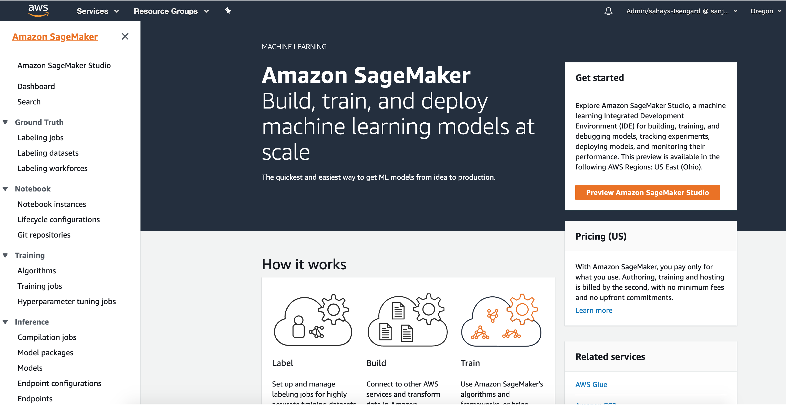
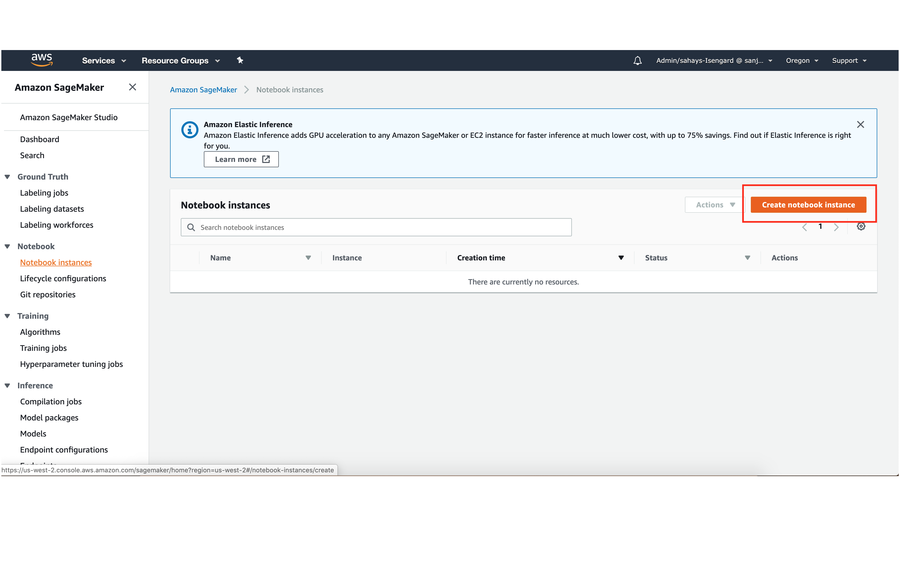
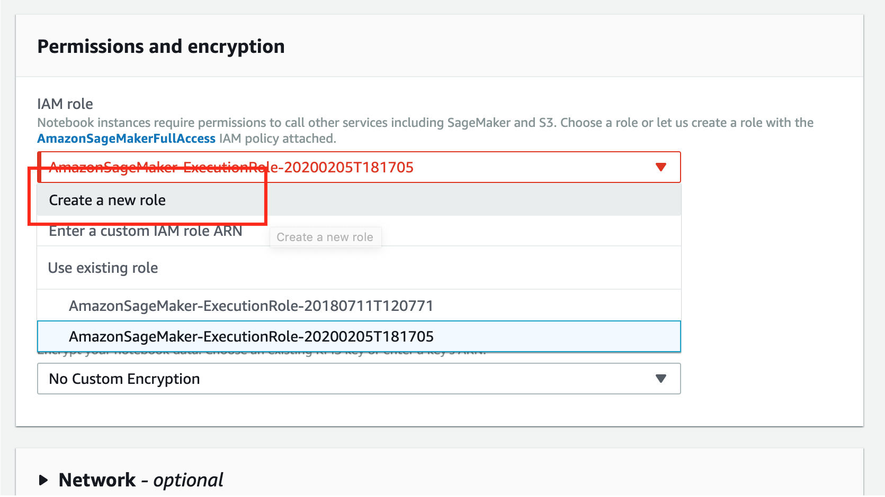
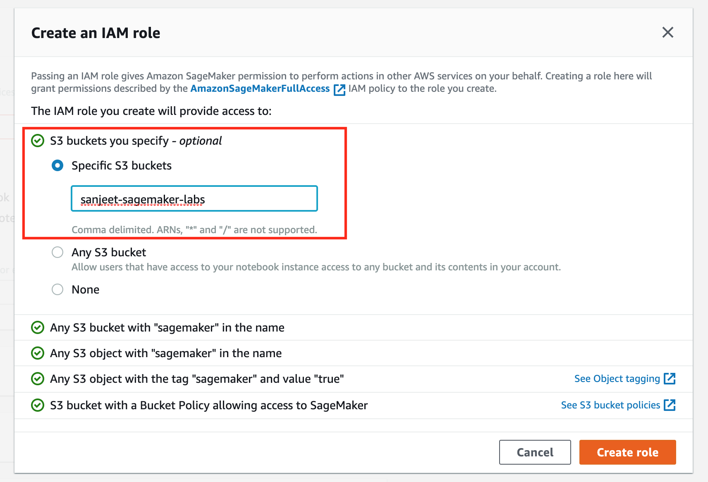
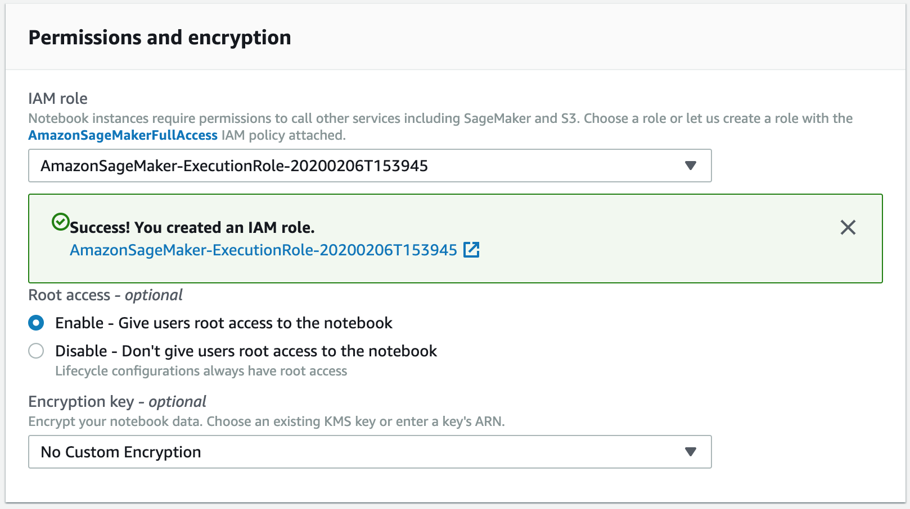
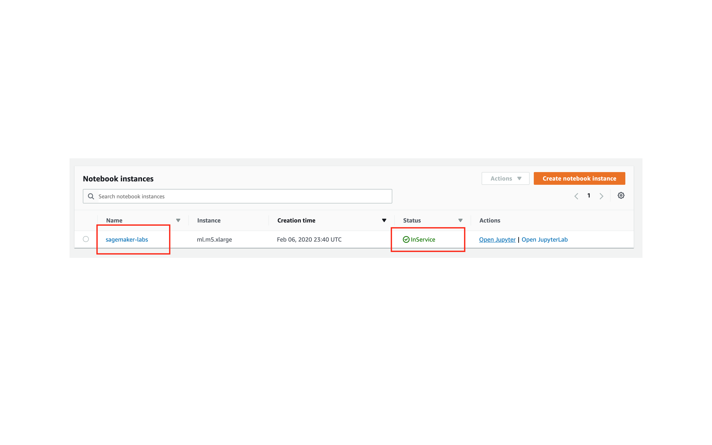
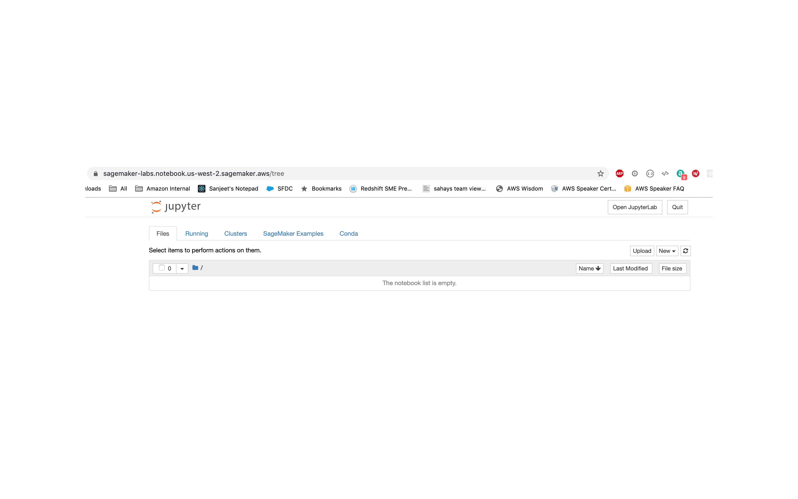
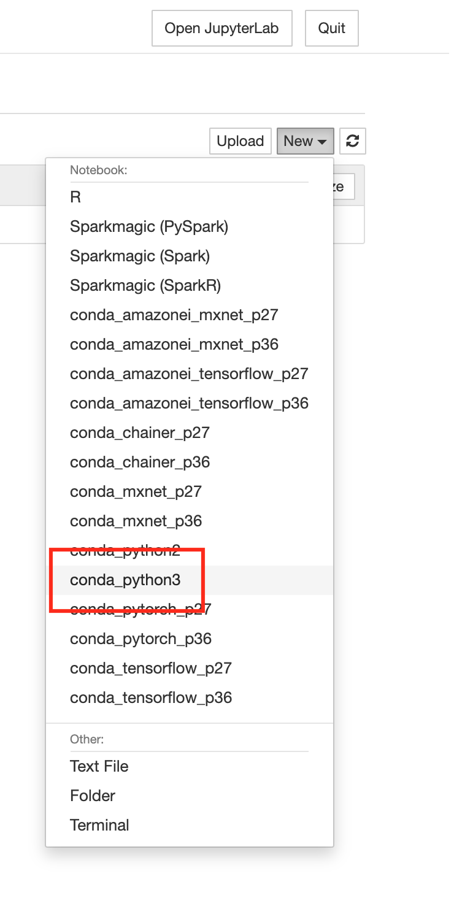
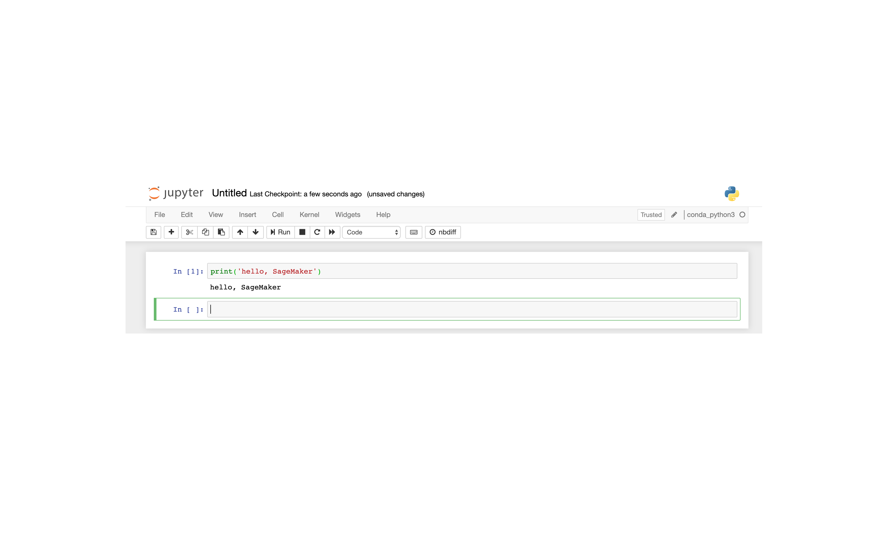

# Lab 01: Setting up Amazon SageMaker Notebook instance

## AWS Console

## Notebook instances

## Create a notebook

## Permissions and IAM roles
Create a new IAM role

## Notebook in service

## Hello, Jupyter!

## Choose Python3

## Finally. Hello, world!

