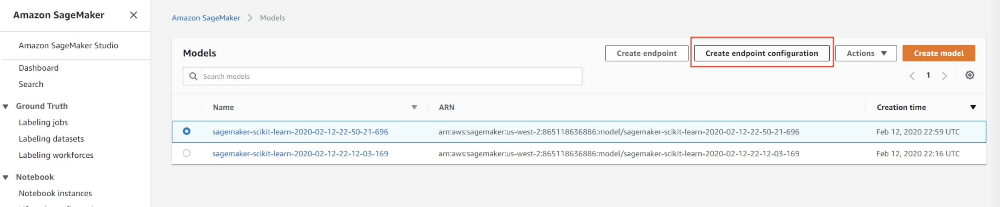
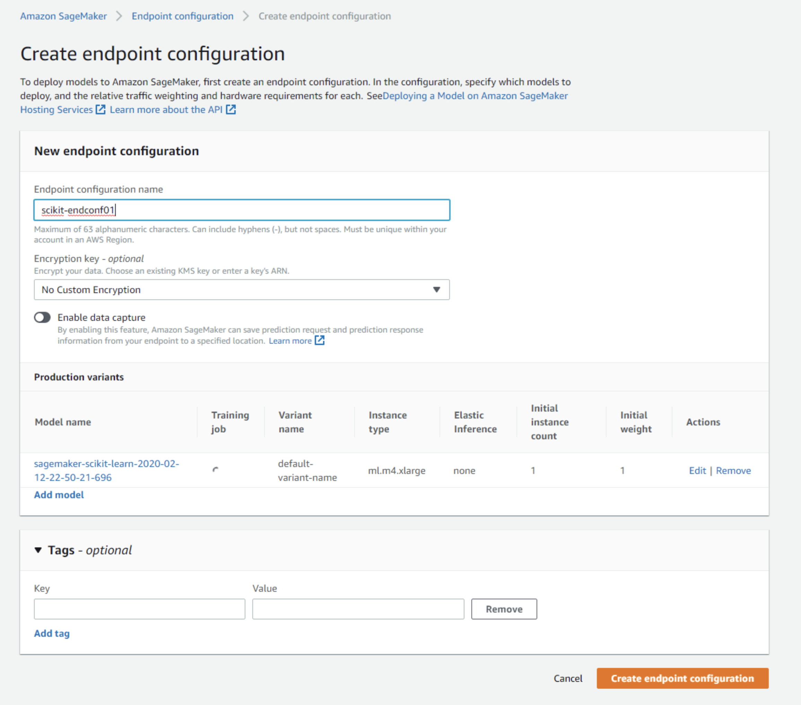
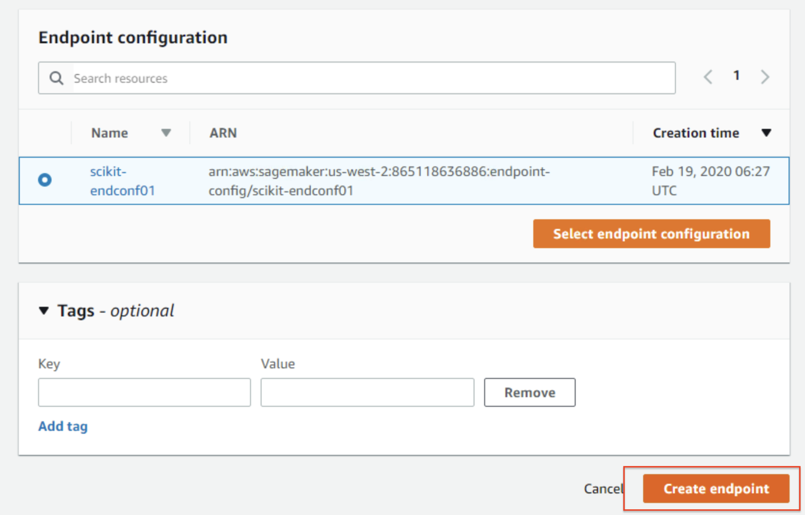
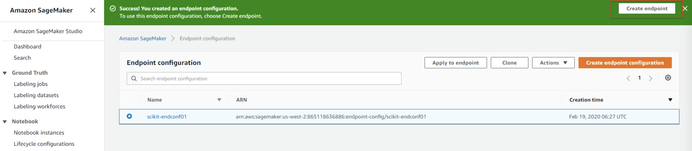
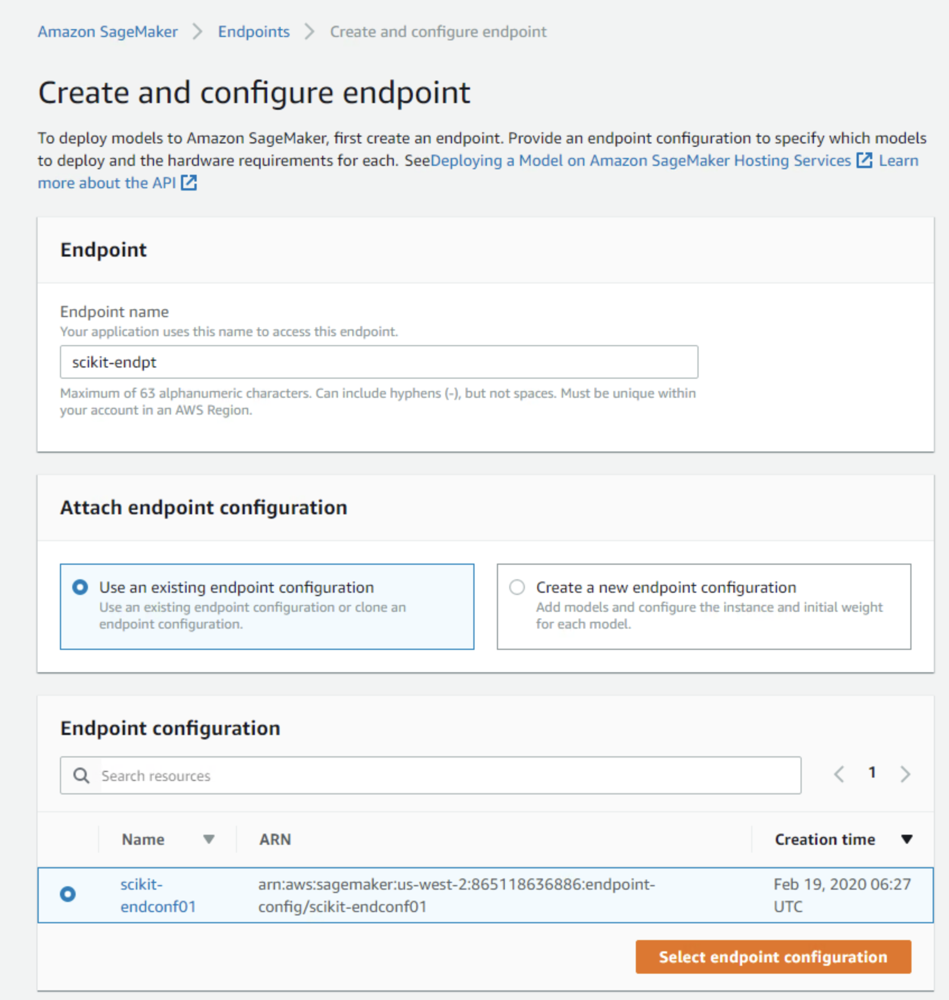
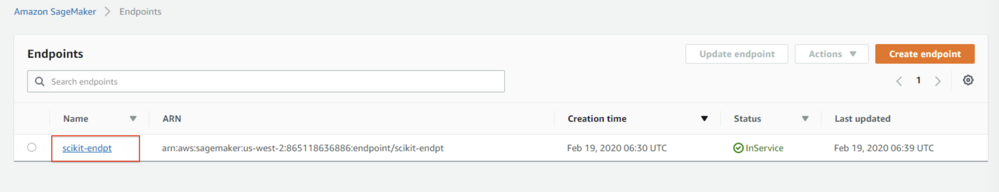
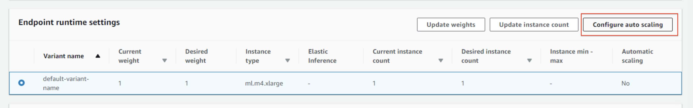
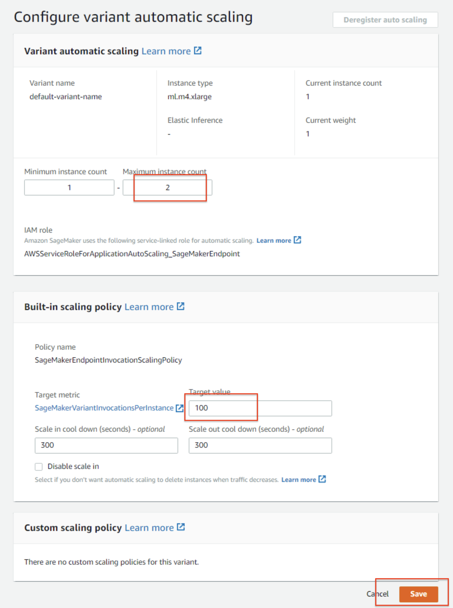

# Lab: Autoscaling Amazon SageMaker endpoints

In this lab, we'll use AWS Console to setup Amazon Sagemaker endpoint and then
configure its autoscaling

## Select a trained model

## Create an endpoint configuration

## Create an Endpoint

Click on "Create endpoint"  Then,
create and configure endpoint 

## Configure autoscaling

Click on the endpoint to open it's settings page
 then, scroll down to "Endpoint
runtime settings" to select the variant and then click on "Configure
autoscaling"  Now,
configure autoscaling properties - for this example I have set "Maximum instance
count" to 2 and "Target value" to 100 for the target metric
"SageMakerVariantInvocationPerInstance" (the average number of times per minute
that each instance for a variant is invoked), then clicked on "Save"

[< Home](./readme.md)
