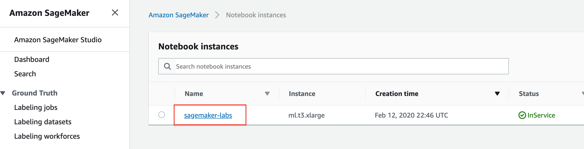
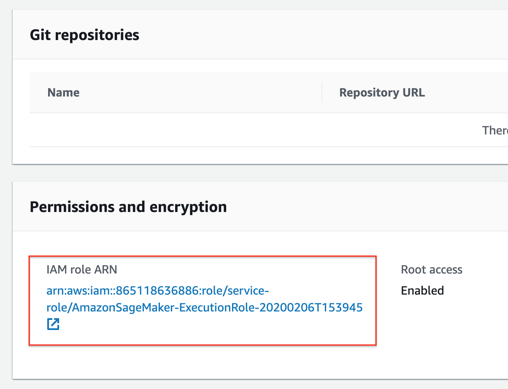
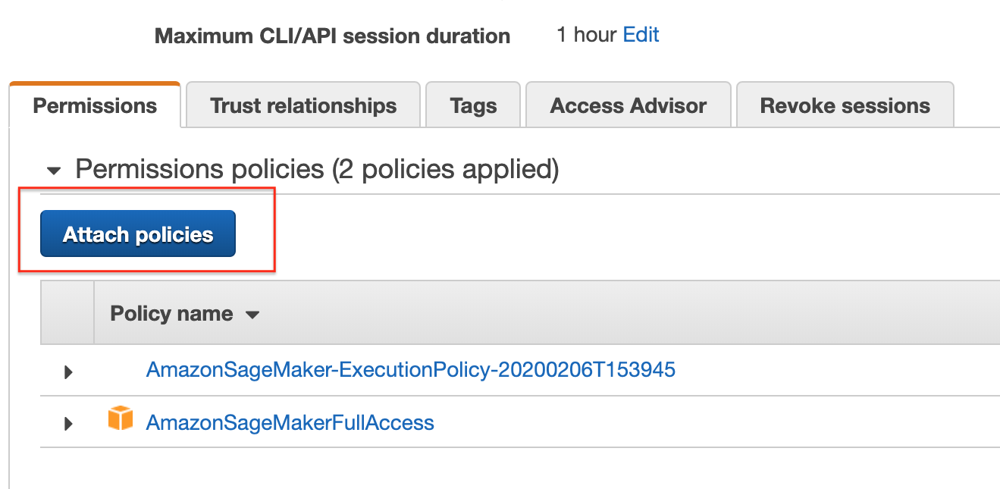
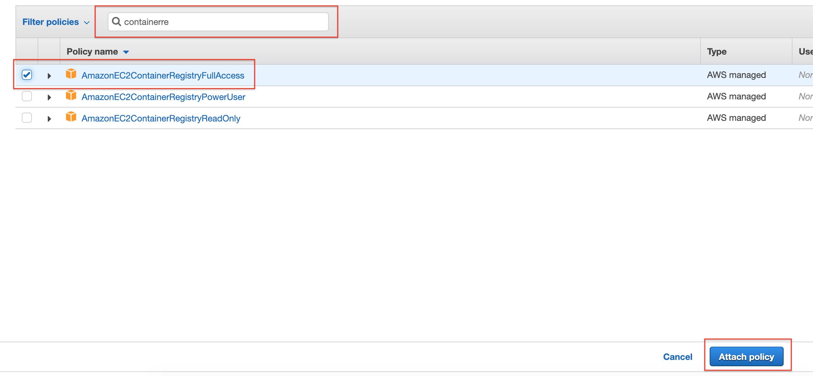
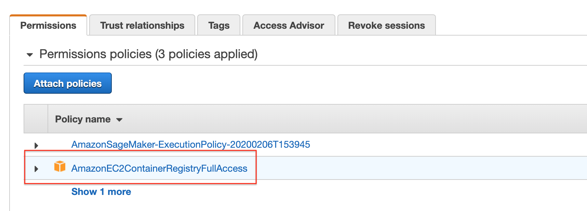

# Lab: Bring your own model with Amazon SageMaker

## When should I build my own algorithm container?

You may not need to create a container to bring your own code to Amazon
SageMaker. When you are using a framework (such as Apache MXNet or TensorFlow)
that has direct support in SageMaker, you can simply supply the Python code that
implements your algorithm using the SDK entry points for that framework. This
set of frameworks is continually expanding, so we recommend that you check the
current list if your algorithm is written in a common machine learning
environment.

Even if there is direct SDK support for your environment or framework, you may
find it more effective to build your own container. If the code that implements
your algorithm is quite complex on its own or you need special additions to the
framework, building your own container may be the right choice.

## Setup required permissions

Running this notebook requires permissions in addition to the normal
SageMakerFullAccess permissions. This is because we'll creating new repositories
in Amazon ECR. The easiest way to add these permissions is simply to add the
managed policy AmazonEC2ContainerRegistryFullAccess to the role that you used to
start your notebook instance. There's no need to restart your notebook instance
when you do this, the new permissions will be available immediately.

Go to Amazon SageMaker console and click on your notebook instance


Scroll down, if you have to, to locate "Permissions and encryption" then click
on the "IAM role ARN" 

Click on "Attach Policy" 

Find and select "AmazonEC2ContainerRegistryFullAccess" then click on "Attach
policy" 

Just verify than "AmazonEC2ContainerRegistryFullAccess" is part of the role


## Overview

Here, we'll show how to package a simple Python example which showcases the
decision tree algorithm from the widely used scikit-learn machine learning
package. The example is purposefully fairly trivial since the point is to show
the surrounding structure that you'll want to add to your own code so you can
train and host it in Amazon SageMaker.

The ideas shown here will work in any language or environment. You'll need to
choose the right tools for your environment to serve HTTP requests for
inference, but good HTTP environments are available in every language these
days.

In this example, we use a single image to support training and hosting. This is
easy because it means that we only need to manage one image and we can set it up
to do everything. Sometimes you'll want separate images for training and hosting
because they have different requirements. Just separate the parts discussed
below into separate Dockerfiles and build two images. Choosing whether to have a
single image or two images is really a matter of which is more convenient for
you to develop and manage.

If you're only using Amazon SageMaker for training or hosting, but not both,
there is no need to build the unused functionality into your container.

## Building the container

Docker provides a simple way to package arbitrary code into an image that is
totally self-contained. Once you have an image, you can use Docker to run a
container based on that image. Running a container is just like running a
program on the machine except that the container creates a fully self-contained
environment for the program to run. Containers are isolated from each other and
from the host environment, so the way you set up your program is the way it
runs, no matter where you run it.

Amazon SageMaker uses Docker to allow users to train and deploy arbitrary
algorithms.

### Parts of the container

In the container directory are all the components you need to package the sample
algorithm for Amazon SageMager:

```
.
|-- Dockerfile
|-- build_and_push.sh
`-- decision_trees
    |-- nginx.conf
    |-- predictor.py
    |-- serve
    |-- train
    `-- wsgi.py
```

Let's discuss each of these in turn:

- Dockerfile describes how to build your Docker container image. More details
  below.
- build_and_push.sh is a script that uses the Dockerfile to build your container
  images and then pushes it to ECR. We'll invoke the commands directly later in
  this notebook, but you can just copy and run the script for your own
  algorithms.
- decision_trees is the directory which contains the files that will be
  installed in the container.
- local_test is a directory that shows how to test your new container on any
  computer that can run Docker, including an Amazon SageMaker notebook instance.
  Using this method, you can quickly iterate using small datasets to eliminate
  any structural bugs before you use the container with Amazon SageMaker. We'll
  walk through local testing later in this notebook.

In this simple application, we only install five files in the container.

The files that we'll put in the container are:

- nginx.conf is the configuration file for the nginx front-end. Generally, you
  should be able to take this file as-is.
- predictor.py is the program that actually implements the Flask web server and
  the decision tree predictions for this app. You'll want to customize the
  actual prediction parts to your application. Since this algorithm is simple,
  we do all the processing here in this file, but you may choose to have
  separate files for implementing your custom logic.
- serve is the program started when the container is started for hosting. It
  simply launches the gunicorn server which runs multiple instances of the Flask
  app defined in predictor.py. You should be able to take this file as-is.
- train is the program that is invoked when the container is run for training.
  You will modify this program to implement your training algorithm.
- wsgi.py is a small wrapper used to invoke the Flask app. You should be able to
  take this file as-is.

In summary, the two files you will probably want to change for your application
are train and predictor.py

### The Dockerfile

The Dockerfile describes the image that we want to build. You can think of it as
describing the complete operating system installation of the system that you
want to run. A Docker container running is quite a bit lighter than a full
operating system, however, because it takes advantage of Linux on the host
machine for the basic operations.

For the Python science stack, we will start from a standard Ubuntu installation
and run the normal tools to install the things needed by scikit-learn. Finally,
we add the code that implements our specific algorithm to the container and set
up the right environment to run under.

```console
!curl http://d1rwcpsuqsa5hl.cloudfront.net/scikit_bring_your_own.zip --output scikit_bring_your_own.zip
!unzip scikit_bring_your_own.zip
!mv scikit_bring_your_own/data ./
!mv scikit_bring_your_own/container ./
!rm scikit_bring_your_own.zip
!rm -rf scikit_bring_your_own
!cat container/Dockerfile
```

### Building and registering the container

```python
%%sh

# The name of our algorithm
algorithm_name=sagemaker-decision-trees

cd container

chmod +x decision_trees/train
chmod +x decision_trees/serve

account=$(aws sts get-caller-identity --query Account --output text)

# Get the region defined in the current configuration (default to us-west-2 if none defined)
region=$(aws configure get region)
region=${region:-us-west-2}

fullname="${account}.dkr.ecr.${region}.amazonaws.com/${algorithm_name}:latest"

# If the repository doesn't exist in ECR, create it.
aws ecr describe-repositories --repository-names "${algorithm_name}" > /dev/null 2>&1

if [ $? -ne 0 ]
then
    aws ecr create-repository --repository-name "${algorithm_name}" > /dev/null
fi

# Get the login command from ECR and execute it directly
$(aws ecr get-login --region ${region} --no-include-email)

# Build the docker image locally with the image name and then push it to ECR
# with the full name.

docker build  -t ${algorithm_name} .
docker tag ${algorithm_name} ${fullname}

docker push ${fullname}
```

## Using the container

Here we specify a bucket to use and the role that will be used for working with
SageMaker.

```python
# S3 prefix
prefix = 'DEMO-scikit-byo-iris'

# Define IAM role
import boto3
import re

import os
import numpy as np
import pandas as pd
from sagemaker import get_execution_role

role = get_execution_role()
```

The session remembers our connection parameters to SageMaker. We'll use it to
perform all of our SageMaker operations.

```python
import sagemaker as sage
from time import gmtime, strftime

sess = sage.Session()
```

When training large models with huge amounts of data, you'll typically use big
data tools, like Amazon Athena, AWS Glue, or Amazon EMR, to create your data in
S3. For the purposes of this example, we're using some the classic Iris dataset,
which we have included.

We can use use the tools provided by the SageMaker Python SDK to upload the data
to a default bucket.

```python
WORK_DIRECTORY = 'data'

data_location = sess.upload_data(WORK_DIRECTORY, key_prefix=prefix)
```

In order to use SageMaker to fit our algorithm, we'll create an Estimator that
defines how to use the container to train. This includes the configuration we
need to invoke SageMaker training:

- The container name. This is constructed as in the shell commands above.
- The role. As defined above.
- The instance count which is the number of machines to use for training.
- The instance type which is the type of machine to use for training.
- The output path determines where the model artifact will be written.
- The session is the SageMaker session object that we defined above.

Then we use fit() on the estimator to train against the data that we uploaded
above.

```python
account = sess.boto_session.client('sts').get_caller_identity()['Account']
region = sess.boto_session.region_name
image = '{}.dkr.ecr.{}.amazonaws.com/sagemaker-decision-trees:latest'.format(account, region)

tree = sage.estimator.Estimator(image,
                       role, 1, 'ml.c4.2xlarge',
                       output_path="s3://{}/output".format(sess.default_bucket()),
                       sagemaker_session=sess)

tree.fit(data_location)
```

### Hosting your model

You can use a trained model to get real time predictions using HTTP endpoint.
Follow these steps to walk you through the process.

Deploying the model to SageMaker hosting just requires a deploy call on the
fitted model. This call takes an instance count, instance type, and optionally
serializer and deserializer functions. These are used when the resulting
predictor is created on the endpoint.

```python
from sagemaker.predictor import csv_serializer
predictor = tree.deploy(1, 'ml.m4.xlarge', serializer=csv_serializer)
```

In order to do some predictions, we'll extract some of the data we used for
training and do predictions against it. This is, of course, bad statistical
practice, but a good way to see how the mechanism works.

```python
shape=pd.read_csv("data/iris.csv", header=None)
shape.sample(3)
```

```python
# drop the label column in the training set
shape.drop(shape.columns[[0]],axis=1,inplace=True)
shape.sample(3)
```

```python
import itertools

a = [50*i for i in range(3)]
b = [40+i for i in range(10)]
indices = [i+j for i,j in itertools.product(a,b)]

test_data=shape.iloc[indices[:-1]]
```

Prediction is as easy as calling predict with the predictor we got back from
deploy and the data we want to do predictions with. The serializers take care of
doing the data conversions for us.

```python
print(predictor.predict(test_data.values).decode('utf-8'))
```

[< Prev: Lab 03](./03-lab.md) | [Home](./readme.md) |
[Next: Lab 05 >](./05-lab.md)
