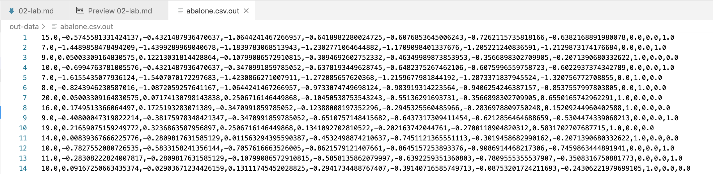

# Lab: Feature engineering with Amazon SageMaker

## Overview

Typically a Machine Learning (ML) process consists of few steps: data gathering
with various ETL jobs, pre-processing the data, featurizing the dataset by
incorporating standard techniques or prior knowledge, and finally training an ML
model using an algorithm.

In many cases, when the trained model is used for processing real time or batch
prediction requests, the model receives data in a format which needs to
pre-processed (e.g. featurized) before it can be passed to the algorithm.

In this lab, we will demonstrate how to perform feature engineering while
building an ML Pipeline leveraging the SageMaker Scikit-learn container and
SageMaker Linear Learner algorithm & after the model is trained, run batch
inferences using Amazon SageMaker Batch Transform.

We will demonstrate this using the Abalone Dataset to guess the age of Abalone
with physical features. The dataset is available from UCI Machine Learning; the
aim for this task is to determine age of an Abalone (a kind of shellfish) from
its physical measurements. We'll use SageMaker's Scikit-learn container to
featurize the dataset so that it can be used for training with Linear Learner.

## Step 1

In the Notebook that you created in the previous lab, copy and paste the
following code to create a SageMaker session and role, and create a S3 prefix to
use for the notebook example.

```python
import sagemaker
from sagemaker import get_execution_role

sagemaker_session = sagemaker.Session()

# S3 prefix
bucket = '< ENTER BUCKET NAME HERE >'
prefix = 'Scikit-LinearLearner-pipeline-abalone-example'

# Get a SageMaker-compatible role used by this Notebook Instance.
# you created this role in the previous step
role = get_execution_role()
```

## Step 2

Download the dataset from this publically available S3 bucket and save it to
`abalone_data` folder on your SageMaker instance

```shell
!wget --directory-prefix=./abalone_data https://s3-us-west-2.amazonaws.com/sparkml-mleap/data/abalone/abalone.csv
```

## Step 3

Now, upload the data to your own S3 bucket inside a folder respresented by the
`prefix` variable

```python
WORK_DIRECTORY = 'abalone_data'

train_input = sagemaker_session.upload_data(
    path='{}/{}'.format(WORK_DIRECTORY, 'abalone.csv'),
    bucket=bucket,
    key_prefix='{}/{}'.format(prefix, 'train'))
```

## Step 4

Let's start creating pre-processing scripts.

Now we are ready to create the container that will preprocess our data before
it’s sent to the trained Linear Learner model. This container will run the
`sklearn_abalone_featurizer.py` script, which Amazon SageMaker will import for
both training and prediction. Training is executed using the main method as the
entry point, which parses arguments, reads the raw abalone dataset from Amazon
S3, then runs the `SimpleImputer` and `StandardScaler` on the numeric features
and `SimpleImputer` and `OneHotEncoder` on the categorical features. At the end
of training, the script serializes the fitted `ColumnTransformer` to Amazon S3
so that it may be used during inference.

### Feature engineering using Amazon SageMaker [inference pipelines](https://docs.aws.amazon.com/sagemaker/latest/dg/inference-pipelines.html)

We will train our classifier with the following features:

- Numeric Features:
  - length: Longest shell measurement
  - diameter: Diameter perpendicular to length
  - height: Height with meat in shell
  - whole_weight: Weight of whole abalone
  - shucked_weight: Weight of meat
  - viscera_weight: Gut weight (after bleeding)
  - shell_weight: Weight after being dried
- Categorical Features:
  - sex: categories encoded as strings {'M', 'F', 'I'} where 'I' is Infant

### Explanation of the code

This training script is very similar to one you might run outside of SageMaker,
but you can access useful properties about the training environment through
various environment variables, such as:

- SM_MODEL_DIR: A string representing the path to the directory to write model
  artifacts to. These artifacts are uploaded to S3 for model hosting.
- SM_OUTPUT_DIR: A string representing the filesystem path to write output
  artifacts to. Output artifacts may include checkpoints, graphs, and other
  files to save, not including model artifacts. These artifacts are compressed
  and uploaded to S3 to the same S3 prefix as the model artifacts.

Supposing two input channels, 'train' and 'test', were used in the call to the
Chainer estimator's fit() method, the following will be set, following the
format SMCHANNEL[channel_name]:

- SM_CHANNEL_TRAIN: A string representing the path to the directory containing
  data in the 'train' channel
- SM_CHANNEL_TEST: Same as above, but for the 'test' channel.

A typical training script loads data from the input channels, configures
training with hyperparameters, trains a model, and saves a model to `model_dir`
so that it can be hosted later. Hyperparameters are passed to your script as
arguments and can be retrieved with an `argparse.ArgumentParser` instance.

```python
from __future__ import print_function

import time
import sys
from io import StringIO
import os
import shutil

import argparse
import csv
import json
import numpy as np
import pandas as pd

from sklearn.compose import ColumnTransformer
from sklearn.externals import joblib
from sklearn.impute import SimpleImputer
from sklearn.pipeline import Pipeline
from sklearn.preprocessing import Binarizer, StandardScaler, OneHotEncoder

from sagemaker_containers.beta.framework import (
    content_types, encoders, env, modules, transformer, worker)

# Since we get a headerless CSV file we specify the column names here.
feature_columns_names = [
    'sex', # M, F, and I (infant)
    'length', # Longest shell measurement
    'diameter', # perpendicular to length
    'height', # with meat in shell
    'whole_weight', # whole abalone
    'shucked_weight', # weight of meat
    'viscera_weight', # gut weight (after bleeding)
    'shell_weight'] # after being dried

label_column = 'rings'

feature_columns_dtype = {
    'sex': str,
    'length': np.float64,
    'diameter': np.float64,
    'height': np.float64,
    'whole_weight': np.float64,
    'shucked_weight': np.float64,
    'viscera_weight': np.float64,
    'shell_weight': np.float64}

label_column_dtype = {'rings': np.float64} # +1.5 gives the age in years

def merge_two_dicts(x, y):
    z = x.copy()   # start with x's keys and values
    z.update(y)    # modifies z with y's keys and values & returns None
    return z
```

```python
if __name__ == '__main__':
    # Hyperparameters are passed to your script as arguments and can be retrieved with an `argparse.ArgumentParser` instance
    parser = argparse.ArgumentParser()

    # SageMaker specific arguments. Defaults are set in the environment variables.
    parser.add_argument('--output-data-dir', type=str, default=os.environ['SM_OUTPUT_DATA_DIR'])
    parser.add_argument('--model-dir', type=str, default=os.environ['SM_MODEL_DIR'])
    parser.add_argument('--train', type=str, default=os.environ['SM_CHANNEL_TRAIN'])

    args = parser.parse_args()

    # Take the set of files and read them all into a single pandas dataframe
    input_files = [ os.path.join(args.train, file) for file in os.listdir(args.train) ]
    if len(input_files) == 0:
        raise ValueError(('There are no files in {}.\n' +
                          'This usually indicates that the channel ({}) was incorrectly specified,\n' +
                          'the data specification in S3 was incorrectly specified or the role specified\n' +
                          'does not have permission to access the data.').format(args.train, "train"))

    raw_data = [ pd.read_csv(
        file,
        header=None,
        names=feature_columns_names + [label_column],
        dtype=merge_two_dicts(feature_columns_dtype, label_column_dtype)) for file in input_files ]
    concat_data = pd.concat(raw_data)

    # This section is adapted from the scikit-learn example of using preprocessing pipelines:
    #
    # https://scikit-learn.org/stable/auto_examples/compose/plot_column_transformer_mixed_types.html
    #
    # We will train our classifier with the following features:
    # Numeric Features:
    # - length:  Longest shell measurement
    # - diameter: Diameter perpendicular to length
    # - height:  Height with meat in shell
    # - whole_weight: Weight of whole abalone
    # - shucked_weight: Weight of meat
    # - viscera_weight: Gut weight (after bleeding)
    # - shell_weight: Weight after being dried
    # Categorical Features:
    # - sex: categories encoded as strings {'M', 'F', 'I'} where 'I' is Infant
    numeric_features = list(feature_columns_names)
    numeric_features.remove('sex')
    numeric_transformer = Pipeline(steps=[
        ('imputer', SimpleImputer(strategy='median')),
        ('scaler', StandardScaler())])

    categorical_features = ['sex']
    categorical_transformer = Pipeline(steps=[
        ('imputer', SimpleImputer(strategy='constant', fill_value='missing')),
        ('onehot', OneHotEncoder(handle_unknown='ignore'))])

    preprocessor = ColumnTransformer(
        transformers=[
            ('num', numeric_transformer, numeric_features),
            ('cat', categorical_transformer, categorical_features)],
        remainder="drop")

    preprocessor.fit(concat_data)

    joblib.dump(preprocessor, os.path.join(args.model_dir, "model.joblib"))

    print("saved model!")
```

The next methods of the script are used during inference. The `input_fn` and
`output_fn` methods will be used by Amazon SageMaker to parse the data payload
and reformat the response. In this example, the input method only accepts
`‘text/csv’` as the content-type, but can easily be modified to accept other
input formats. The input_fn function also checks the length of the csv passed to
determine whether to preprocess training data, which includes the label, or
prediction data. The output method returns back in JSON format because by
default the Inference Pipeline expects JSON between the containers, but can be
modified to add other output formats.

```python
def input_fn(input_data, content_type):
    """Parse input data payload

    We currently only take csv input. Since we need to process both labelled
    and unlabelled data we first determine whether the label column is present
    by looking at how many columns were provided.
    """
    if content_type == 'text/csv':
        # Read the raw input data as CSV.
        df = pd.read_csv(StringIO(input_data),
                         header=None)

        if len(df.columns) == len(feature_columns_names) + 1:
            # This is a labelled example, includes the ring label
            df.columns = feature_columns_names + [label_column]
        elif len(df.columns) == len(feature_columns_names):
            # This is an unlabelled example.
            df.columns = feature_columns_names

        return df
    else:
        raise ValueError("{} not supported by script!".format(content_type))
```

```python
def output_fn(prediction, accept):
    """Format prediction output

    The default accept/content-type between containers for serial inference is JSON.
    We also want to set the ContentType or mimetype as the same value as accept so the next
    container can read the response payload correctly.
    """
    if accept == "application/json":
        instances = []
        for row in prediction.tolist():
            instances.append({"features": row})

        json_output = {"instances": instances}

        return worker.Response(json.dumps(json_output), accept, mimetype=accept)
    elif accept == 'text/csv':
        return worker.Response(encoders.encode(prediction, accept), accept, mimetype=accept)
    else:
        raise RuntimeException("{} accept type is not supported by this script.".format(accept))
```

Our `predict_fn` will take the input data, which was parsed by our `input_fn`,
and the deserialized model from the `model_fn` (described in detail next) to
transform the source data. The script also adds back labels if the source data
had labels, which would be the case for preprocessing training data.

```python
def predict_fn(input_data, model):
    """Preprocess input data

    We implement this because the default predict_fn uses .predict(), but our model is a preprocessor
    so we want to use .transform().

    The output is returned in the following order:

        rest of features either one hot encoded or standardized
    """
    features = model.transform(input_data)

    if label_column in input_data:
        # Return the label (as the first column) and the set of features.
        return np.insert(features, 0, input_data[label_column], axis=1)
    else:
        # Return only the set of features
        return features
```

The `model_fn` takes the location of a serialized model and returns the
deserialized model back to Amazon SageMaker. Note that this is the only method
that does not have a default because the definition of the method will be
closely linked to the serialization method implemented in training. In this
example, we use the joblib library included with Scikit-learn.

```python

def model_fn(model_dir):
    """Deserialize fitted model
    """
    preprocessor = joblib.load(os.path.join(model_dir, "model.joblib"))
    return preprocessor
```

## Step 5: Fit the data preprocessor

```python
from sagemaker.sklearn.estimator import SKLearn

script_path = '/home/ec2-user/sample-notebooks/sagemaker-python-sdk/scikit_learn_inference_pipeline/sklearn_abalone_featurizer.py'

sklearn_preprocessor = SKLearn(
    entry_point=script_path,
    role=role,
    train_instance_type="ml.c4.xlarge",
    sagemaker_session=sagemaker_session)

sklearn_preprocessor.fit({'train': train_input})
```

## Step 6: Batch transform the training data

Now that our proprocessor is properly fitted, let's go ahead and preprocess our
training data. Let's use batch transform to directly preprocess the raw data and
store right back into Amazon S3.

### Define a SKLearn Transformer from the trained SKLearn Estimator

```python
transformer = sklearn_preprocessor.transformer(
    instance_count=1,
    instance_type='ml.m4.xlarge',
    assemble_with = 'Line',
    accept = 'text/csv')
```

### Preprocess training input

```python
transformer.transform(train_input, content_type='text/csv')
print('Waiting for transform job: ' + transformer.latest_transform_job.job_name)
transformer.wait()
preprocessed_train = transformer.output_path
print(preprocessed_train)
```

When the transformer is done, our transformed data will be stored in Amazon S3.
You can find the location of the preprocessed data by looking at the values in
the `preprocessed_train` variable.

### Transformed output



[< Home](./readme.md)
